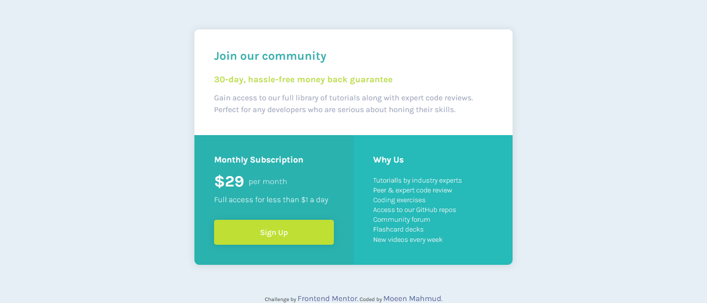

# Frontend Mentor - Single price grid component solution

This is a solution to the [Single price grid component challenge on Frontend Mentor](https://www.frontendmentor.io/challenges/single-price-grid-component-5ce41129d0ff452fec5abbbc). Frontend Mentor challenges help you improve your coding skills by building realistic projects.

## Table of contents

- [Overview](#overview)
  - [The challenge](#the-challenge)
  - [Screenshot](#screenshot)
  - [Links](#links)
- [My process](#my-process)
  - [Built with](#built-with)
  - [What I learned](#what-i-learned)
  - [Continued development](#continued-development)
  - [Useful resources](#useful-resources)
- [Author](#author)

## Overview

### The challenge

Users should be able to view the optimal layout depending on their device's screen size

### Screenshot



### Links

- Solution URL: [Git Repo](https://github.com/moeen-mahmud/single-price-grid-component)
- Live Site URL: [Live Site](https://single-price-grid-component-kappa-sable.vercel.app/)

## My Process

### Built With

- HTML5 markup
- SASS
- Flexbox
- Grid
- Mobile-first workflow
- [GoogleFonts](https://fonts.google.com/) - For font styles

### What I learned

In this project I have tried [SASS](https://sass-lang.com/) for the first time. For me, It was a good experience. Though I did not use its full potential. I explored the language and learn about its power. I really love the parent selector option shown below.

```scss
button {
  width: 100%;
  padding: 1rem 0;
  background-color: $primary-bright-yellow;
  border: none;
  border-radius: 5px;
  box-shadow: $shadows;
  cursor: pointer;

  .btn-primary--style {
    text-decoration: none;
    color: $neutral-white;
  }

  &:hover {
    opacity: 0.9;
  }
}
```

### Continued Development

I will try to make one or two projects based on SASS and try to use its full potential.

### Useful resources

- [Dev Ed's 20 Minutes of SASS](https://youtu.be/Zz6eOVaaelI) - I think it's a good place to start if you want to give a try.
- [SASS Documentation](https://sass-lang.com/documentation) - I always try to follow the documentation for my learning process.

## Author

- Frontend Mentor - [fahim-mahmud](https://www.frontendmentor.io/profile/fahim-mahmud)
- Twitter - [moeen_mahmud](https://twitter.com/moeen_mahmud)
